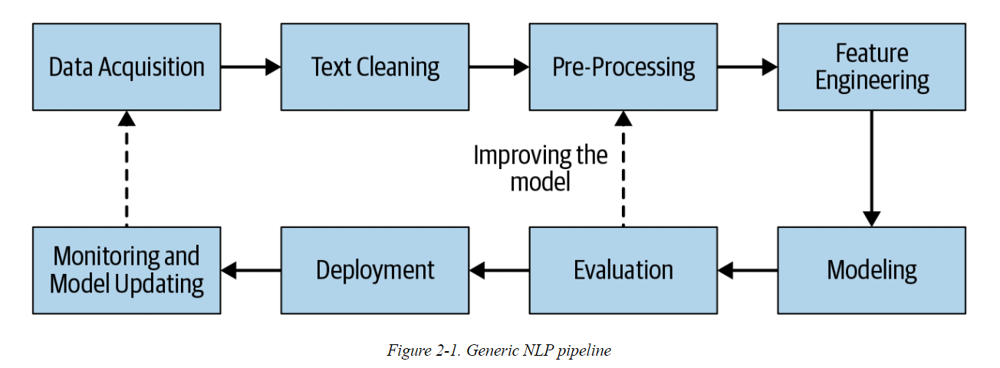

# Cuisine Classifier - Demystify Cuisine and Culture From Ingredients using Natural Language Processing and Machine Learning

## Why Cuisine Classifier?

In this project, I’ve used Natural Language Processing (NLP) and Machine Learning (ML) to classify recipes into more than 20 cuisines from ingredients' text. Let’s think about ingredients as your shopping cart. With the global pandemic still raging in many parts of the world, more and more people are cooking at home. With many of them opting for buying grocery online and scanning their reward cards, businesses can collect a massive amount of data on what and how often their customers buy. By being able to connect what grocery customers often buy to their favorite cuisines, businesses can understand more about their customers, and hence tailor promotion to their unique needs. I sometimes collect Coles/Woolies magazines for their beautiful images, but often find that many of their recipes are not practical for my family. Behind a cuisine is a culture. With Australia being a multicultural country, understanding more about customers’ cultural background via their shopping cart will add so much more value to them. And as we all know, if customers are happier with us, they’ll shop more with us.

Before starting the project, I've also checked out Google Cloud Natural Language APIs that provide off-the-shelf content classification models to identify hundreds of different categories of text. Though there exist about 20 categories in food and drink section, there is no cuisine classification available to use.

## Where is the data from?

The ingredients' text and some images of nearly 5000 recipes have been fully scraped from https://www.bbc.co.uk/food/cuisines. I've found this website is well-structured in cuisine classification and rich in recipe content. Please refer to my [webscraping notebook](data/00_extract_scraped_bbcfood_cuisine.ipynb) for more details.

The cuisine classification is quite subjective and can vary among recipe websites. Relabelling cuisines might be necessary depending on specific analysis requirements. 

## NLP pipeline

(Source: Practical Natural Language Processing by Sowmya Vajjala, Bodhisattwa Majumder, Anuj Gupta, and Harshit Surana (O’Reilly))

The workflow is illustrated in the above NLP pipeline.

* Data Acquisition: webscrape the data using BeautifulSoup and Splinter.

* Exploratory Data Analysis: use Python, Pandas, Numpy, Matplotlib, Seaborn, Bag of Words, Bag of Bi-grams, Word Cloud, etc. Please refer to EDA notebook [here](model/00_EDA.ipynb).

* Text cleaning and pre-processing:

    * Use Python regular expression, and other NLP libraries including string, unicodedata, and NLTK.
    
    * NLTK libraries used to do word tokenization, removal of stop words, stemming, and lemmatization.

* Feature Engineering: use Bag of Words and Bag of Bi-grams with TF-IDF.

* Modeling: sklearn libraries. Trained models include Naive Bayes, Random Forest, and SVC with and without oversampling for unigram and bigrams.

* Evaluation: use accuracy score, confusion matrix, classification report, and k-fold cross validation.

**Please refer to models' training and evaluation [here](model/)

* Machine Learning Web App:

    * Back end: Python Flask-powered RESTful API

    * Front end: HTML, CSS (with Bootstrap), Javascript

    * Database: SQLite

    * Deployment: Please explore the [web app](https://cuisine-demystifier.herokuapp.com/) successfully deployed to Heroku.

## Demo

## TO DO:

* More data cleaning: removing more words that do not add much value to the task, e.g. preparation steps.
* Collect more high-quality data
* Keep training the models with more data
* Explore the text classification with more machine learning models and deep learning models
* Try Feature engineering with word embeddings
* Hyper parameter tuning
* Add more styles and data visualisations to front end

---
I make no claims about the ownership of the data. Hence, please do what you'd love with the data but credit the appropriate people.