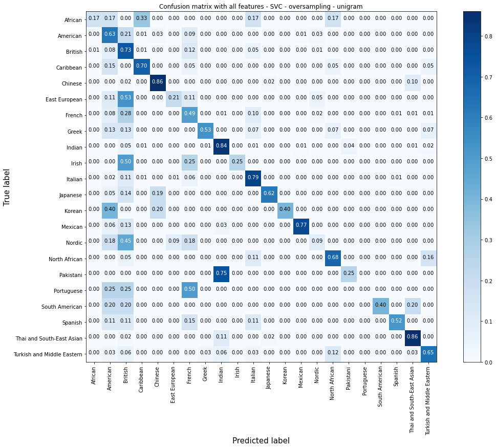

# Cuisine Classifier - Demystify Cuisine and Culture From Ingredients using Natural Language Processing and Machine Learning

## Why Cuisine Classifier?

In this project, I’ve used Natural Language Processing (NLP) and Machine Learning (ML) to classify recipes into more than 20 cuisines from ingredients' text. Let’s think about ingredients as your shopping cart. With the global pandemic still raging in many parts of the world, more and more people are cooking at home. With many of them opting for buying grocery online and scanning their reward cards, businesses can collect a massive amount of data on what and how often their customers buy. By being able to connect what grocery customers often buy to their favorite cuisines, businesses can understand more about their customers, and hence tailor promotion to their unique needs. I sometimes collect Coles/Woolies magazines for their beautiful images, but often find that many of their recipes are not practical for my family. Behind a cuisine is a culture. With Australia being a multicultural country, understanding more about customers’ cultural background via their shopping cart will add so much more value to them. And as we all know, if customers are happier with us, they’ll shop more with us.

Before starting the project, I've also checked out [Google Cloud Natural Language APIs](https://cloud.google.com/natural-language/docs/categories) that provide off-the-shelf content classification models to identify hundreds of different categories of text. Though there exist about 20 categories in food and drink section, there is no cuisine classification available to use.

## Demo

Please explore my [app](https://cuisine-demystifier.herokuapp.com/). Any feedback is welcome!

## Where is the data from?

The ingredients' text and some images of nearly 5000 recipes have been fully scraped from https://www.bbc.co.uk/food/cuisines. I've found that this website is well-structured in cuisine classification and rich in recipe content. Please refer to my [webscraping notebook](data/00_extract_scraped_bbcfood_cuisine.ipynb) for more details.

The cuisine classification is quite subjective and can vary among recipe websites. Relabelling cuisines might be necessary depending on specific analysis requirements. 

## NLP pipeline

(Source: Practical Natural Language Processing by Sowmya Vajjala, Bodhisattwa Majumder, Anuj Gupta, and Harshit Surana (O’Reilly))

The workflow is illustrated in the above NLP pipeline.

* Data Acquisition: webscraped the data using BeautifulSoup and Splinter.

* Exploratory Data Analysis: used Python, Pandas, Numpy, Matplotlib, Seaborn, Bag of Words, Bag of Bi-grams, Word Cloud, etc. Please refer to the **[EDA notebook](model/00_EDA.ipynb)** for more details.

* Text cleaning and pre-processing:

    * Used Python regular expression, and other NLP libraries including string, unicodedata, and NLTK.
    
    * NLTK libraries used to do word tokenization, removal of stop words, stemming, and lemmatization.

* Feature Engineering: used Bag of Words and Bag of Bi-grams with TF-IDF.

* Modeling: scikit-learn libraries. Trained models include Naive Bayes (NB), Random Forest, and SVC with or without oversampling for unigram, and both unigram and bigrams.

* Evaluation: used accuracy score, confusion matrix, classification report, and k-fold cross validation.

* Monitoring and Model Updating: create a second form in the front-end to get users' feedback on the trained model's prediction. In case an outcome is wrong, users can choose a listed correct cuisine, or manually enter a correct cuisine. Users can also provide recipes' names and links (if any). Users' feedback will be recorded into a database for monitoring and assessing model performance in production phase. New data provided can also be used to retrain existing and new models.

    **Please refer to the [models' training and evaluation](model/) for more details.**

    **The chosen model is SVC with TF-IDF unigram and oversampling.** It has the highest average accuracy score in k-fold cross validation. Like NB model using unigram, it predicts very well in Chinese, Indian, Mexican, Thai and South-East Asian cuisines. It misses out completely on Portuguese cuisine, and scores very low on Nordic cuisine. A closer look suggests that it does much better than the NB model with unigram in identifying dominant labels like British and Italian cuisines. This can explain the higher overall score of the model. The SVC model with unigram does better than the NB model with unigram in some labels and vice versa. As I'm not particularly interested in any specific cuisine, I'll select the SVC model with unigram. Following is the Confusion Matrix of the SVC model with unigram and oversampling.
    
    
    
* ML Web App:

    * Back end: Python Flask-powered RESTful API. Use Python "pickle" library to save a vectorized vocabulary to feed into the application to transform new ingredient text data.

    * Front end: HTML, CSS (with Bootstrap), Javascript.

    * Database: SQLite for development. Remote PostgreSQL on Heroku to update table `feedback` with users' input.

    * Deployment: Successfully deployed to Heroku.

## How to run the codes on your local machine

1. Clone the github repo to your local machine:

    `git@github.com:momcancode/Cuisine-Demystifier-NLP-ML-Project.git`

2. Ensure that the libraries listed in requirements.txt installed. Otherwise, run:

    `$ pip install -r requirements.txt`
    
3. Run `app.py` in your command and you're now ready to explore the app.

## Future enhancements:

* More high-quality data to train existing and new ML models

* Add more styles and data visualisations to front end

* By understanding more about users' favorite cuisine, we can add features such as:

    * Recommend recipes based on users' favorite cuisine/ingredients

    * Add ingredients to shopping list

    * Link users' shopping lists to promotions by online grocery shopping sites

---
I make no claims about the ownership of the data. Hence, please do what you'd love with the data but credit the appropriate people.